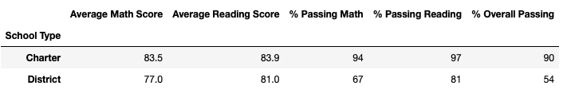

# School District Analysis

# Overview

Thomas High School ninth-graders' reading and math grades appear to have been altered in the students_complete.csv file according to the school board. Even though the school board is unaware of the entire scope of the cheating, they are looking for assistance in upholding state testing requirements. 

In this project, Thomas High School's math and reading test scores would be replaced with NaN values while keeping the rest of the data intact. The school board wants to repeat the school district analysis conducted previously and receive a report about how these adjustments influenced the overall study once the reading and math scores have been replaced.

# Results

- How is the district summary affected?

As the district summary tables for initial analysis and the challenge analysis shown below, after changing to NaN the math and reading scores of all the 9th grade students at Thomas High School, there is not too much difference between the two summaries at district level. The "Average Math Score" changed by 0.1 points, while the "Average Reading Score" keeps the same in both cases. The total number of 9th Grade students at Thomas High School is 461, which represents 1.18% of the total students (39170). This percentage is too low to make a big difference on the results for the total school district.

  #### Distrct Summary (Initial):

  #### Distrct Summary (Challenge):

- How is the school summary affected?

Since only the math and reading scores of all the 9th grade students at Thomas High School are changed while the rest of the data is untouched, the results stayed the same for all the schools, except Thomas High School itself. 

There are two parts of school summary. The first part of analysis uses the "vlaue_count()" function to calculate the total number of students in Thomas High School, including the 9th grade students with "NaN" math and reading scores. However, when counting the number of student passing math/reading, the 9th students with "NaN" scores are ignored. Thus, the number of student passing math/reading is decreased comparing with original analysis. The passing percentage is calculated using the number of passing the math/reading devided by the total number of students. As a result, the value for "% Passing Reading", "% Passing Math" and "% Overall Passing" for Thomas High School are decreased significantly. The values for "Average Reading Score" and "Average Math Score" remained pretty much unchanged because the ".mean()" function in Pandas ignores the NaN values. 

In the second part of challenge analysis for school summary. The "loc" Method is used to count the total number of student of Thomas High School in 10th grade, 11th grade and 12th grade. The total number of student, except the 9th grade students, is 1174. The number of student passing math/reading determined by filtering also ignores the 9th grade students who have "NaN" math and reading scores.  Thus, the total number of students and the number of passing students are both decreased, which will not affact the passing percentage too much according to the formula for the passing percentage: 

  per_school_passing_math_percentage = per_school_passing_math / per_school_counts * 100
  per_school_passing_reading_percentage = per_school_passing_reading / per_school_counts * 100
  per_overall_passing_percentage = per_passing_math_reading / per_school_counts * 100

The school summary tables for the Thomas High School from the original analysis and the challenge analysis are shown below:

  #### School Summary (Initial) for Thomas High School:

  #### School Summary (Challenge, Part 1) for Thomas High School:

  #### School Summary (Challenge, Part 2) for Thomas High School:

- How does replacing the ninth graders’ math and reading scores affect Thomas High School’s performance relative to the other schools?

The rest part of analysis is based on the passing rate we got in the second part of challenge analysis for school summary. The passing rate is not changed too much, so the Thomas High School’s performance is also not changed too much. The overall passing rate for Thomas High School only decreased 0.2%. 

In the original analysis, the top five schools based on the overall passing rate are:
 
 
  #### Top Five School (Initial) :

In the challenge analysis, the top five schools based on the overall passing rate are:

  #### Top Five School (Challenge) :

- How does replacing the ninth-grade scores affect math and reading scores by grade?

When reviewing the math and reading scores summary per school and grade, the change only affects the figures of Thomas High School, the numbers for the other schools remain unchanged.

  #### Math Score (Initial):

  #### Math Score (Challenge):

  #### Reading Score (Initial):

  #### Reading Score (Challenge):

- How does replacing the ninth-grade scores affect math and reading scores by school spending?

From the tables for school spending summary are shown below, there is not to much difference for the math and reading scores by school spending after replacing the 9th grade scores. The Thomas High School is in 6th place in both cases.

  #### School Spending Summary (Initial):
  

  #### School Spending Summary (Challenge):
  

- How does replacing the ninth-grade scores affect math and reading scores by school size?

The "Average Math Score", "Average Reading Score" and the "% Overall Passing" values are the same after the change to the scores of 9th grade students at Thomas High School.

  #### School Size Summary (Initial):
  

  #### School Size Summary (Challenge):
  

- How does replacing the ninth-grade scores affect math and reading scores by school type?

The school type summary table for both cases are shown below. There is no difference between both analysis. 

  #### School Type Summary (Initial):
  

  #### School Type Summary (Challenge):
  

# Summary

In conclusion, the changes in the updated school district analysis after reading and math scores for the ninth grade at Thomas High School have been replaced with NaNs are:

- The total number of students passing math exam at Thomas High School is decreased
- The total number of students passing reading exam at Thomas High School is decreased
- The overall passing rate for Thomas High School is decreased
